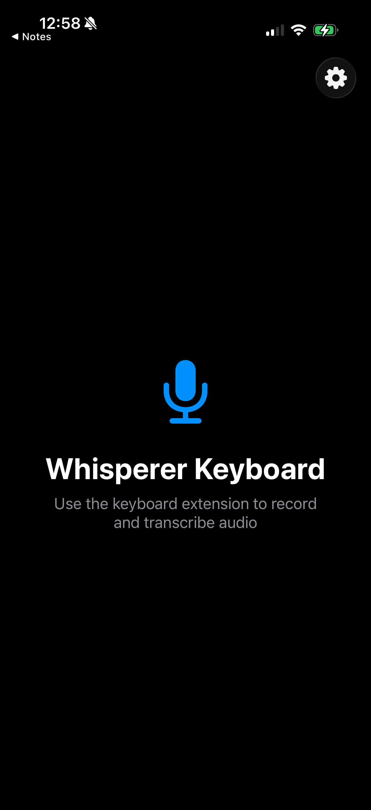
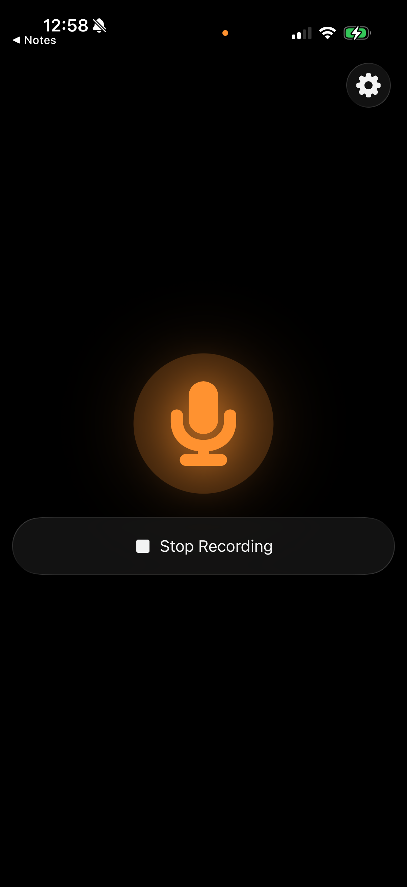
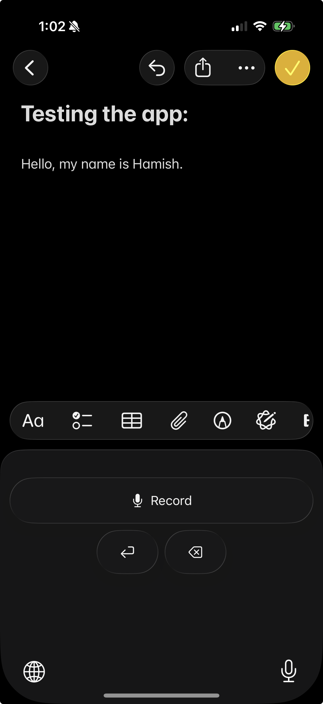
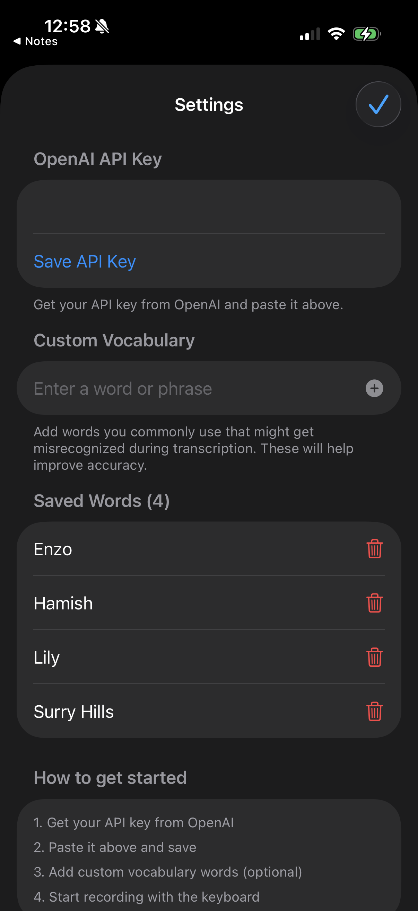

# WhispererKeyboard

An enhanced iOS custom keyboard using OpenAI's `gpt-4o-transcribe` API for speech-to-text conversion.

## Features

- **Voice-to-Text Transcription**: Captures audio from the microphone and sends it to OpenAI's `gpt-4o-transcribe` API for accurate transcription
- **Modern iOS 26 UI**: Updated interface with contemporary design patterns
- **Custom Dictionary**: Add frequently used words and phrases for better transcription accuracy
- **Enhanced Keyboard**: Updated keyboard layout and functionality improvements

## How It Works

1. Tap the microphone button on the keyboard
2. Speak your message
3. Switch back to the app you were using
4. Transcribed text is automatically inserted into the active text field

## Screenshots

  
  
  
  
  

## Installation

1. Clone this repository
2. Open `WhispererKeyboard.xcodeproj` in Xcode
3. Add your OpenAI API key in the settings
4. Build and install on your iOS device
5. Enable the keyboard in Settings > General > Keyboard > Keyboards > Add New Keyboard

## Requirements

- iOS 26.0+
- Xcode 26.0+
- OpenAI API key

> **Note:** This project is forked from [lcf/WhispererKeyboard](https://github.com/lcf/WhispererKeyboard.git) with significant improvements for usability and modern iOS compatibility.

## License

See [LICENSE](LICENSE) for details.
